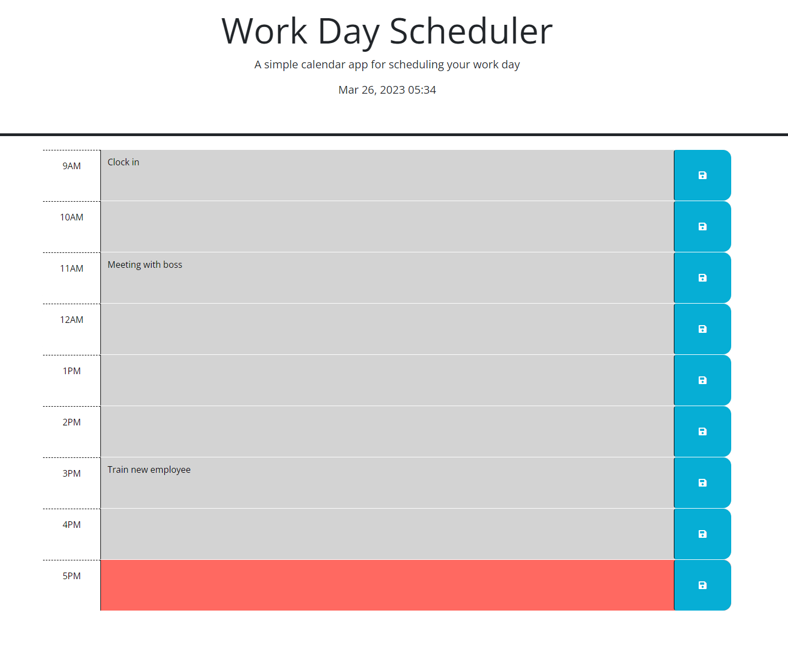

## Work-Day Scheduler Project

# Description

This program is a tool for scheduling events in a work-day. Events can be typed into the boxes and then saved with the corresponding button, when the page is reloaded, the content is still there. The boxes are colored based on time, gray represents the past hours, red represents the current hour, and green represents the future hours. The current time is shown at the top for reference and is live. All events must be entered in a text-box back to back, resaving the box with a new event will clear the previous contents.

# Screenshots

This screenshot shows the page the user lands on

This screenshot shows the page after entering info into the boxes

# Link to Application

https://sohzo.github.io/Work-Day-Scheduler/

# Sources

The code for changing box color and displaying local storage properties (located in script.js) was partially inspired using Stack Overflow forums